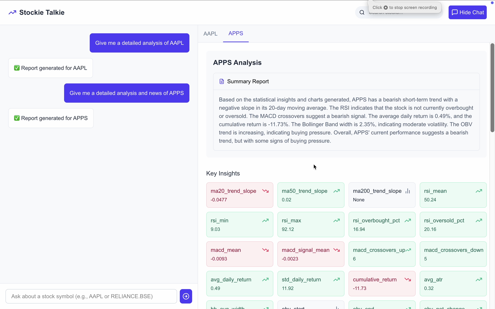
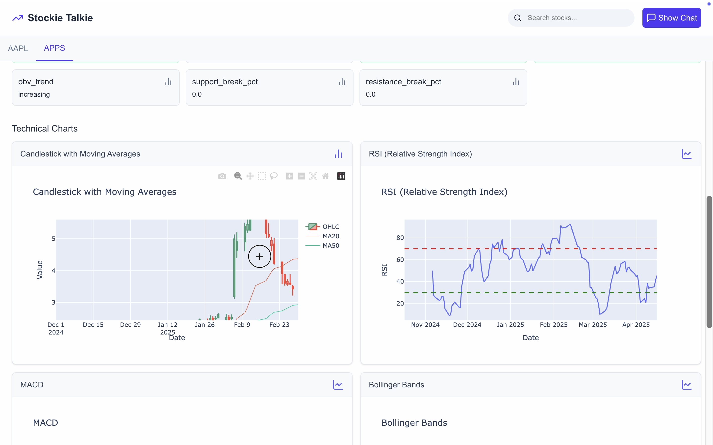

# StockieTalkie: LLM-Powered Stock Analysis Agent

StockieTalkie is an interactive AI-driven stock analysis application powered by LlamaIndex's ReActAgent and Groq LLM APIs. It integrates multiple tools to perform detailed analysis of stocks including OHLCV data fetching, technical indicators, chart generation, and real-time news retrieval.

## Features

- Natural language interaction to analyze any stock symbol
- OHLCV data retrieval using `yfinance`
- Technical indicator and trend analysis
- Chart generation with Plotly
- Real-time news from Yahoo Finance
- Interactive React-based frontend with dynamic tabs and chat

## Tools Integrated

- `search_ticker_yfinance`: Resolves the full stock symbol based on partial names
- `get_ohlcv`: Fetches historical price data
- `generate_statistical_insights`: Computes technical indicators and trends
- `plot_stock_chart`: Creates visual charts for stock movement
- `get_yahoo_finance_news`: Retrieves latest headlines related to the stock

## Architecture

- **Backend**: Python, LlamaIndex, FastAPI
- **Frontend**: React (TypeScript), TailwindCSS, Framer Motion
- **Agent**: LlamaIndex ReActAgent with tool chaining

## Setup Instructions

### 1. Clone the Repository

```bash
git clone https://github.com/yourusername/stockie-talkie-agent.git
cd stockie-talkie-agent
```

### 2. Backend Setup

Install the Python dependencies:

```bash
pip install -r requirements.txt
```

Create a `.env` file in the root directory and add your Groq API key:

```
API_KEY=your_groq_api_key_here
```

Run the FastAPI backend:

```bash
uvicorn main:app --reload
```

### 3. Frontend Setup

Go to the `frontend` directory and install dependencies:

```bash
cd frontend
npm install
npm run dev
```

### 4. Interact with the Agent

- Open your browser at `http://localhost:3000`
- Ask questions like:
  - `Give me a detailed analysis of AAPL`
  - `What is the trend for NVDA.MX with news?`
  - `Show me charts for TCS.NS`
- `Or, search for the ticker and click it!`

---

## Screenshots






---

## Troubleshooting

- If news does not appear, ensure the Yahoo Finance proxy route is functioning correctly in the backend.
- If charts are not displayed, check that `/static/charts/` is correctly served and file paths are valid.
- Make sure the `.env` file exists and `API_KEY` is correctly set.

---

## License

This project is licensed under the MIT License.